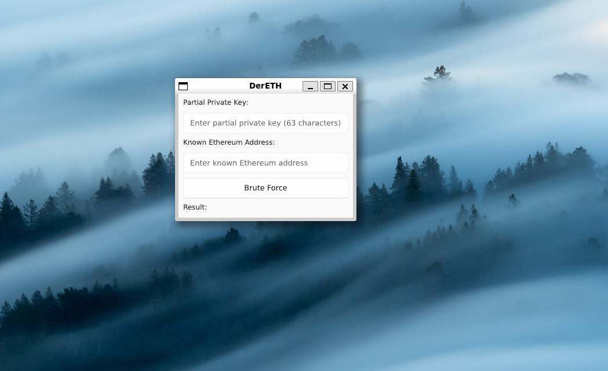

<h1 align="center">🔧DerETH</h1>

<p align="center">
  <a href="github.com/V1337Q/DerETH-Tools">
    
  </a>
</p>

<div align="center">
	<a href="https://www.rust-lang.org/tools/install">Rust</a>
  <span> • </span>
    	<a href="https://docs.slint.dev/latest/docs/slint/">Slint</a>
  <p></p>
</div> 

# Preview





A tools for deriving an Ethereum address from a private key and perform a brute-force to find a missing character in a partial private key that matches a Public Ethereum address.

## Depedencies

1. cargo
2. Rustc
3. X11 Libraries
```
sudo apt update
sudo apt install libx11-dev libxcb1-dev libxrandr-dev libxinerama-dev libxcursor-dev libxi-dev libgl1-mesa-dev
``` 
4. libxkbcommon-x11
```
sudo apt update
sudo apt install libxkbcommon-x11-0
```

## Installation

1. Install Rust by following its [getting-started guide](https://www.rust-lang.org/learn/get-started).
   Once this is done, you should have the `rustc` compiler and the `cargo` build system installed in your `PATH`.
2. Clone the repo:
    ``` 
    git clone https://github.com/V1337Q/DerETH-Tools.git
    ``` 
3. cd to the repo
    ``` 
    cd DerETH-Tools
    ```
4. Build the depedencies with `cargo`:
    ```
    cargo build
    ```
5. Run the application binary:
    ```
    cargo run
    ```
*NOTES*: This is the GUI version of the previous repository that i've created (github.com/V1330Q/dereth) If you're more comfortable with the CLI and didn't need the GUI, use that one instead.

## What this tools CAN NOT do
*DerETH* is a tool designed to derive a Private Ethereum address, that's missing a character, A CHARACTER (no matter where the position are.) with the known address, or public address. So it cannot (at least for now) be used to brute force an address with MORE THAN ONE missing character. 
